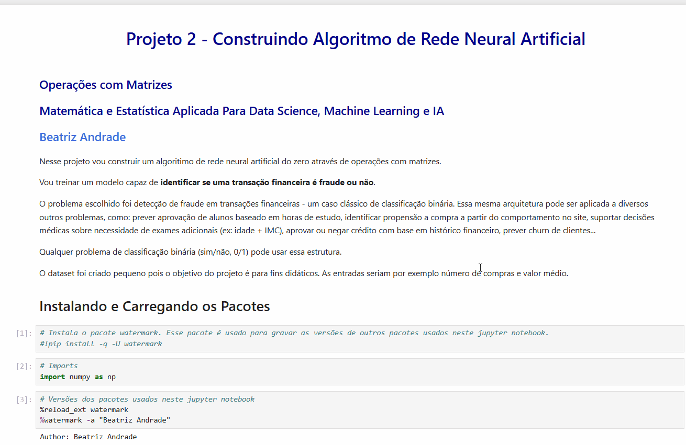

# Rede Neural Artificial do Zero para Detecção de Fraude

[](https://www.python.org/)
[](https://numpy.org/)
[](https://github.com/biasandrade/rede-neural-deteccao-fraude)

Implementei uma rede neural artificial **do zero** usando apenas NumPy para detectar fraudes em transações financeiras. O objetivo foi entender **como uma rede neural funciona por dentro**, sem usar TensorFlow, Keras ou PyTorch.

---

## Objetivo

Construir uma rede neural artificial sem usar bibliotecas prontas (TensorFlow, Keras, PyTorch) para:

- Entender a matemática por trás das redes neurais
- Implementar forward e backward propagation manualmente
- Detectar padrões de fraude em transações financeiras

<br/>

---

## Outras aplicações

O problema escolhido foi detecção de fraude em transações financeiras - um caso clássico de classificação binária. Mas essa mesma arquitetura pode ser aplicada a diversos outros problemas, como:

- **Detecção de fraude:** Identificar transações suspeitas em cartões de crédito
- **Educação:** Prever aprovação de alunos baseado em horas de estudo e notas
- **E-commerce:** Identificar propensão a compra a partir do comportamento no site
- **Saúde:** Apoiar decisões médicas sobre necessidade de exames (ex: idade + IMC)
- **Crédito:** Aprovar ou negar empréstimos com base em histórico financeiro
- **Spam:** Classificar emails como spam ou legítimos
- **Churn:** Prever se cliente vai cancelar serviço
- **App engagement:** Prever se usuário vai abrir o app no dia seguinte

Qualquer problema de classificação binária (sim/não, 0/1) pode usar essa estrutura.

<br/>

---

## Demonstração



<br/>

### Processo de Treinamento

 **Forward Pass:**
    
```python
previsão = sigmoid(W·X + b)
```

**Cálculo do Erro:**
```python
erro = previsão - y_real
```

**Backward Pass:**
```python
∂W = (1/n) · X^T · erro
∂b = (1/n) · Σ(erro)
```

**Atualização:**
```python
W = W - taxa_aprendizado · ∂W
b = b - taxa_aprendizado · ∂b
```

A cada iteração, os pesos e o bias são ajustados para minimizar o erro.


<br/>

---


<details>
<summary> <b>Ver resultados</b></summary>

<br/>

### Dados de Teste

| Entrada (Transação) | Valor Real | Previsão | Resultado |
|---------------------|------------|----------|-----------|
| [1.5, 2] | Normal (0) | 0 | Acertou |
| [4, 5.5] | Fraude (1) | 1 | Acertou |

### Novos Dados (Deploy)

| Entrada | Previsão | Interpretação |
|---------|----------|---------------|
| [1, 2] | 0 | Transação Normal |
| [4, 5] | 1 | Transação Suspeita |

**Acurácia:** 2/2 corretos nos dados de teste (dataset pequeno, mas o foco aqui é didático).

<br/>

</details>

<br/>

---

<details>
<summary><b>Entendendo o processo de treinamento</b></summary>

### O que acontece a cada iteração?

1. **Forward Pass:** Modelo faz previsões
2. **Cálculo do Erro:** Compara com valores reais
3. **Backward Pass:** Calcula gradientes
4. **Atualização:** Ajusta pesos e bias

Após 1000 iterações, os pesos convergem de [0, 0] para [1.26, -0.47], 
minimizando o erro e aprendendo a separar as classes.

</details>

<br/>

---

<details>
<summary><b>Componentes Implementados</b></summary>

### 1. Função de Ativação Sigmoid
Converte qualquer valor em uma probabilidade entre 0 e 1:
```python
def func_activation_sigmoid(self, pred):
    return 1 / (1 + np.exp(-pred))
```

### 2. Forward Pass
Calcula a saída da rede dado um input:
```python
previsao = np.dot(X, self.pesos) + self.bias
previsao_final = self.func_activation_sigmoid(previsao)
```

### 3. Backward Pass
Ajusta os parâmetros usando gradiente descendente:
```python
dw = (1 / num_registros) * np.dot(X.T, erro)
db = (1 / num_registros) * np.sum(erro)

self.pesos -= self.taxa_aprendizado * dw
self.bias -= self.taxa_aprendizado * db
```

Aqui modelo aprende ajustando pesos e bias iterativamente.

</details>

<br/>

---

## Dataset

Criei um dataset sintético simples para focar no algoritmo:

- **Features:** número de compras e valor médio
- **Classes:** 0 (transação normal) ou 1 (suspeita de fraude)
- **Divisão:** 6 para treino, 2 para teste, 2 para deploy

É um dataset pequeno de propósito - o objetivo é didático, não performance em produção.

<br/>

---

## Como Executar

<details>
<summary><b>Instruções de instalação</b></summary>

### Pré-requisitos
- Python 3.8+
- NumPy
- Jupyter Notebook

### Passo a passo

```bash
# Clone o repositório
git clone https://github.com/BeatrizAndradeDS/rede-neural-do-zero-classificacao-binaria.git

# Entre na pasta
cd rede_neural_class_binaria_fraude

# Instale as dependências
pip install -r requirements.txt

# Abra o notebook
jupyter notebook rede_neural_class_binaria_fraude.ipynb
```

### Executando

O notebook está dividido em 5 partes:
1. Implementação do algoritmo (a classe da rede neural)
2. Preparação dos dados
3. Treinamento (1000 iterações)
4. Avaliação com dados de teste
5. Deploy com dados novos

Execute célula por célula pra acompanhar o processo de treinamento.

</details>

<br/>

---

## Conteúdo Utilizado

Conceitos aplicados:
- **Álgebra Linear:** multiplicação de matrizes, transposição, operações vetoriais
- **Cálculo Diferencial:** derivadas parciais, gradiente
- **Otimização:** gradiente descendente, taxa de aprendizado
- **Machine Learning:** forward propagation, backward propagation, função de ativação sigmoid

O mais interessante foi ver na prática como pequenos ajustes nos pesos, repetidos mil vezes, fazem o modelo convergir para a solução.

<br/>

---

## Próximos Passos

Ideias para evoluir o projeto futuramente:
- [ ] Adicionar métricas (precision, recall, F1)
- [ ] Criar visualização da convergência
- [ ] Testar outras funções de ativação (ReLU, Tanh)
- [ ] Usar dataset real de fraudes (Kaggle)
- [ ] Implementar regularização (L1/L2)
- [ ] Adicionar camadas ocultas (transformar em deep neural network)

---

## Sobre mim

**Beatriz Andrade**  
18 anos trabalhando com dados e agora também com Machine Learning

[](https://www.linkedin.com/in/andrade-beatriz/)
[](https://github.com/BeatrizAndradeDS)
[](mailto:biasandrade@gmail.com)

---


## Licença

MIT License.

---

 Se esse projeto te ajudou a entender redes neurais, considera dar uma estrela!

Beatriz Andrade11-99539-1817
